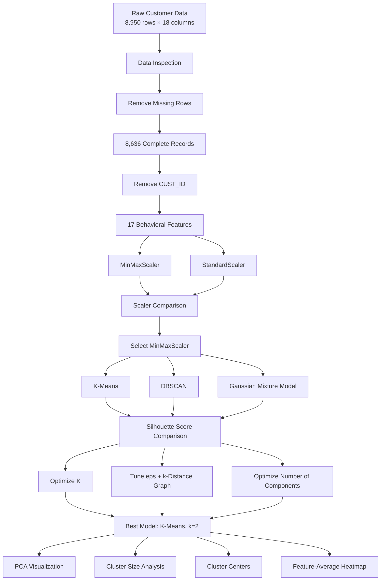

<p align="center">
  
</p>

<h1 align="center">Customer Segmentation Using Unsupervised Learning</h1>

<p align="center">
  <b>Exploring customer financial behavior with K-Means, DBSCAN, and Gaussian Mixture Models</b>
</p>

<p align="center">
  
  
  
  
  
</p>

---

## Overview

Customer segmentation is the process of discovering groups of customers who exhibit similar behavioral patterns. In financial and credit-card data, these patterns may reflect differences in purchasing activity, payment habits, credit utilization, cash-advance behavior, transaction frequency, and account tenure.

This project builds an end-to-end **unsupervised machine learning pipeline** for customer segmentation. Rather than relying on predefined customer labels, the analysis searches for latent structure directly in the data and compares multiple clustering strategies under a consistent evaluation framework.

The workflow includes:

- data inspection and cleaning;
- exploratory data analysis;
- feature scaling with two alternative normalization strategies;
- clustering with **K-Means**, **DBSCAN**, and **Gaussian Mixture Models (GMM)**;
- quantitative comparison using the **Silhouette Score**;
- hyperparameter exploration and model optimization;
- dimensionality reduction with **PCA** for visual inspection;
- cluster-size analysis;
- cluster-center visualization;
- feature-level comparison of the discovered segments.

The final experiments identify **K-Means with two clusters on MinMax-scaled data** as the strongest configuration among the tested approaches.

---

## Table of Contents

- [Project Motivation](#project-motivation)
- [Project Objectives](#project-objectives)
- [Dataset](#dataset)
- [Exploratory Data Analysis](#exploratory-data-analysis)
- [Preprocessing Pipeline](#preprocessing-pipeline)
- [Feature Scaling Experiments](#feature-scaling-experiments)
- [Clustering Methods](#clustering-methods)
- [Evaluation Metric](#evaluation-metric)
- [Model Comparison](#model-comparison)
- [Optimization Strategy](#optimization-strategy)
- [Final Results](#final-results)
- [Visualization and Cluster Analysis](#visualization-and-cluster-analysis)
- [Technical Workflow](#technical-workflow)
- [Installation](#installation)
- [How to Run](#how-to-run)
- [Project Structure](#project-structure)
- [Key Takeaways](#key-takeaways)
- [Limitations](#limitations)
- [Future Improvements](#future-improvements)
- [Author](#author)

---

## Project Motivation

Traditional customer analysis often relies on manually defined rules or previously labeled customer categories. In many real-world settings, however, meaningful customer groups are not known in advance.

Unsupervised learning provides a way to discover these structures directly from behavioral data.

For a financial customer dataset, useful segmentation may help support tasks such as:

- customer profiling;
- personalized marketing;
- differentiated retention strategies;
- financial behavior analysis;
- customer relationship management;
- identification of unusual behavioral patterns;
- data-driven product and service design.

The purpose of this project is therefore not simply to run a clustering algorithm, but to compare different clustering assumptions and determine which approach produces the most coherent segmentation for the available data.

---

## Project Objectives

The main objectives are to:

1. Explore the statistical and behavioral structure of customer financial data.
2. Clean the dataset and remove non-informative attributes.
3. Examine distributions, outliers, pairwise relationships, and feature correlations.
4. Compare **MinMaxScaler** and **StandardScaler** before clustering.
5. Implement three different clustering paradigms:
   - centroid-based clustering;
   - density-based clustering;
   - probabilistic clustering.
6. Compare model quality using a common internal clustering metric.
7. Search for improved model configurations through parameter tuning.
8. Visualize the final segmentation in a lower-dimensional PCA space.
9. Analyze cluster sizes, cluster centers, and cluster-level feature averages.
10. Identify the most suitable clustering configuration among the tested models.

---

## Dataset

The dataset contains customer-level credit-card and financial behavior information.

### Dataset Size

| Stage | Rows | Columns | Notes |
|---|---:|---:|---|
| Raw dataset | 8,950 | 18 | Includes `CUST_ID` |
| After removing incomplete rows | 8,636 | 18 | Missing-value rows removed |
| Features used for clustering | 8,636 | 17 | `CUST_ID` excluded |

A total of **314 rows** were removed because of missing values, corresponding to approximately **3.51%** of the original observations.

### Missing Values

Missing values are present in:

- `CREDIT_LIMIT`
- `MINIMUM_PAYMENTS`

The notebook handles these observations using complete-case removal (`dropna`) before clustering.

### Feature Set

<details>
<summary><b>Click to view all dataset features</b></summary>

| Feature | Description |
|---|---|
| `CUST_ID` | Customer identifier; removed before clustering |
| `BALANCE` | Current customer balance |
| `BALANCE_FREQUENCY` | Frequency with which the balance is updated |
| `PURCHASES` | Total purchase amount |
| `ONEOFF_PURCHASES` | Amount spent on one-off purchases |
| `INSTALLMENTS_PURCHASES` | Amount spent on installment purchases |
| `CASH_ADVANCE` | Amount obtained through cash advances |
| `PURCHASES_FREQUENCY` | Frequency of purchase activity |
| `ONEOFF_PURCHASES_FREQUENCY` | Frequency of one-off purchases |
| `PURCHASES_INSTALLMENTS_FREQUENCY` | Frequency of installment purchases |
| `CASH_ADVANCE_FREQUENCY` | Frequency of cash-advance activity |
| `CASH_ADVANCE_TRX` | Number of cash-advance transactions |
| `PURCHASES_TRX` | Number of purchase transactions |
| `CREDIT_LIMIT` | Credit limit assigned to the customer |
| `PAYMENTS` | Total payments made |
| `MINIMUM_PAYMENTS` | Minimum payments made |
| `PRC_FULL_PAYMENT` | Proportion of full payments |
| `TENURE` | Length of customer membership |

</details>

### Why `CUST_ID` Is Removed

`CUST_ID` uniquely identifies a customer but does not describe financial behavior. Including an arbitrary identifier in a distance-based clustering model could introduce meaningless numerical structure, so it is excluded before model training.

---

## Exploratory Data Analysis

Before clustering, the notebook examines the structure of the dataset through several exploratory visualizations.

### Distribution Analysis

The project investigates individual feature distributions, including:

- `BALANCE`
- `PURCHASES`
- `MINIMUM_PAYMENTS`
- `TENURE`

Distribution plots help reveal:

- skewed financial variables;
- concentration of observations;
- long-tailed customer behavior;
- potential scale differences between features.

### Outlier-Oriented Visualizations

Boxplots are used for variables such as:

- `CREDIT_LIMIT`
- `PRC_FULL_PAYMENT`

These plots provide a quick view of spread, central tendency, and potentially extreme observations.

### Relationship Analysis

Scatter plots are used to inspect relationships such as:

- `ONEOFF_PURCHASES` vs. `INSTALLMENTS_PURCHASES`
- `PURCHASES` vs. `PAYMENTS`

A pair plot is also created for selected high-value financial variables:

- `BALANCE`
- `PURCHASES`
- `ONEOFF_PURCHASES`
- `INSTALLMENTS_PURCHASES`
- `CASH_ADVANCE`

### Correlation Analysis

A correlation heatmap is generated for the numeric variables to inspect linear dependencies and identify groups of related financial behaviors.

EDA is especially important in clustering because there are no target labels to validate the data against. Understanding distributions and relationships is therefore a critical step before interpreting any discovered clusters.

---

## Preprocessing Pipeline

The preprocessing workflow used in the project is:

### 1. Load the Dataset

The data is loaded into a Pandas DataFrame.

### 2. Inspect Data Types and Missingness

The project checks:

- dataset dimensions;
- column types;
- non-null counts;
- variables containing missing observations.

### 3. Remove Incomplete Rows

Rows containing missing values are removed.

```python
cleaned_data = data.dropna()
```

### 4. Remove the Identifier

```python
cleaned_data_numeric = cleaned_data.drop(columns=["CUST_ID"])
```

### 5. Scale Numerical Features

Two alternative transformations are evaluated:

```python
MinMaxScaler()
StandardScaler()
```

The scaling strategy is not chosen arbitrarily. Each clustering algorithm is tested with both transformations and compared using the Silhouette Score.

---

## Feature Scaling Experiments

Feature scaling is essential because the dataset contains variables with substantially different numerical ranges. Without scaling, high-magnitude variables can dominate distance calculations.

Two preprocessing strategies are compared:

### MinMaxScaler

Transforms each feature into a bounded normalized range.

This is useful when the goal is to preserve relative ordering while reducing scale imbalance.

### StandardScaler

Centers each feature around zero and scales it according to its standard deviation.

This is frequently used when standardized feature magnitudes are desirable.

### Scaling Benchmark

The initial scaling experiment uses the same base clustering configurations for each scaler.

| Algorithm | MinMaxScaler | StandardScaler | Better Result |
|---|---:|---:|---|
| K-Means (`k=3`) | **0.3764** | 0.2471 | MinMaxScaler |
| DBSCAN (`eps=0.5`, `min_samples=5`) | **0.3466** | -0.4651 | MinMaxScaler |
| GMM (`n_components=3`) | **0.1380** | 0.1151 | MinMaxScaler |

### Scaling Decision

**MinMaxScaler performs better for all three tested clustering algorithms**, so the subsequent model-comparison and optimization stages use MinMax-scaled features.

This result is an important part of the project: preprocessing choices materially change clustering quality.

---

## Clustering Methods

The project compares three algorithms representing different clustering assumptions.

### 1. K-Means Clustering

K-Means is a centroid-based clustering algorithm.

It partitions observations into `k` groups by iteratively assigning each observation to the nearest centroid and updating the centroids to minimize within-cluster variation.

#### Why It Is Included

K-Means provides:

- a simple and interpretable baseline;
- efficient training on tabular data;
- explicit cluster centers;
- straightforward control over the number of clusters.

#### Initial Configuration

```python
KMeans(
    n_clusters=3,
    random_state=42,
    n_init=10
)
```

Initial Silhouette Score: **0.3764**

---

### 2. DBSCAN

DBSCAN is a density-based clustering algorithm.

Unlike K-Means, it does not require a predefined number of clusters. Instead, it groups observations based on local density and can mark low-density observations as noise.

#### Why It Is Included

DBSCAN provides a useful contrast to centroid-based clustering because it can:

- discover irregularly shaped clusters;
- detect potential noise observations;
- avoid explicitly specifying the number of clusters.

#### Initial Configuration

```python
DBSCAN(
    eps=0.5,
    min_samples=5
)
```

Initial reported Silhouette Score: **0.3466**

---

### 3. Gaussian Mixture Model

Gaussian Mixture Models provide a probabilistic approach to clustering.

Instead of assigning groups purely by nearest distance, GMM assumes that observations are generated by a mixture of Gaussian distributions.

#### Why It Is Included

GMM can represent:

- probabilistic cluster membership;
- overlapping cluster structure;
- distributions with different covariance patterns.

#### Initial Configuration

```python
GaussianMixture(
    n_components=3,
    random_state=42
)
```

Initial Silhouette Score: **0.1380**

---

## Evaluation Metric

### Silhouette Score

The project uses the **Silhouette Score** as the main internal clustering-quality metric.

For each observation, the metric compares:

- cohesion with its own cluster;
- separation from the nearest competing cluster.

The score typically ranges from **-1 to 1**.

| Score Direction | Interpretation |
|---|---|
| Closer to `1` | Better-separated and more cohesive clusters |
| Around `0` | Overlapping or weakly separated structure |
| Below `0` | Potentially poor cluster assignment |

Because the problem is unsupervised and no ground-truth labels are available, the Silhouette Score provides a consistent way to compare candidate clustering configurations.

---

## Model Comparison

After selecting MinMax scaling, the three initial models are compared under their baseline parameters.

| Model | Initial Configuration | Silhouette Score |
|---|---|---:|
| **K-Means** | `k = 3` | **0.3764** |
| DBSCAN | `eps = 0.5`, `min_samples = 5` | 0.3466 |
| GMM | `n_components = 3` | 0.1380 |

At this stage, **K-Means produces the strongest clustering result**.

However, the project does not stop at the baseline configuration. Each algorithm is further investigated.

---

## Optimization Strategy

### K-Means Optimization

The number of clusters is evaluated across:

```text
k = 2, 3, ..., 10
```

For each value of `k`:

1. K-Means is fitted to the MinMax-scaled data.
2. Cluster assignments are generated.
3. The Silhouette Score is calculated.
4. Scores are compared visually.

The strongest configuration is obtained with:

```text
k = 2
```

This increases the Silhouette Score from:

```text
0.3764 → 0.3906
```

---

### DBSCAN Optimization

DBSCAN is investigated in multiple stages.

#### Stage 1: Initial Epsilon Search

The project tests:

```text
eps = 0.1, 0.2, ..., 0.9
```

with:

```text
min_samples = 5
```

#### Stage 2: Wider Epsilon Search

Because the first search does not produce a meaningful improvement, the range is expanded to approximately:

```text
eps = 0.05 to 1.95
```

in increments of `0.05`.

#### Stage 3: k-Distance Analysis

A nearest-neighbor distance graph is generated using:

```python
NearestNeighbors(n_neighbors=5)
```

The elbow region suggests that an `eps` between approximately **0.3 and 0.5** is reasonable.

The original setting:

```text
eps = 0.5
min_samples = 5
```

remains the most acceptable tested DBSCAN configuration.

No parameter search produced a clear improvement over the initial DBSCAN result.

---

### GMM Optimization

The number of mixture components is evaluated across:

```text
n_components = 2, 3, ..., 10
```

The best tested GMM configuration uses:

```text
n_components = 2
```

The Silhouette Score improves from:

```text
0.1380 → 0.1950
```

Although this is a meaningful improvement over the initial GMM configuration, it remains substantially below the optimized K-Means result.

---

## Final Results

### Final Performance Summary

| Rank | Algorithm | Final / Best Tested Configuration | Silhouette Score |
|---:|---|---|---:|
| **1** | **K-Means** | `k = 2`, MinMaxScaler | **0.3906** |
| 2 | DBSCAN | `eps = 0.5`, `min_samples = 5`, MinMaxScaler | **0.3466** |
| 3 | GMM | `n_components = 2`, MinMaxScaler | **0.1950** |

### Improvement After Optimization

| Model | Initial Score | Optimized Score | Change |
|---|---:|---:|---:|
| K-Means | 0.3764 | **0.3906** | +0.0141 |
| GMM | 0.1380 | **0.1950** | +0.0570 |
| DBSCAN | 0.3466 | No clear improvement | — |

### Selected Final Model

```python
KMeans(
    n_clusters=2,
    random_state=42,
    n_init=10
)
```

trained on:

```python
MinMaxScaler().fit_transform(cleaned_data_numeric)
```

### Main Result

Among the three tested approaches, **optimized K-Means provides the best balance of cluster cohesion and separation according to the Silhouette Score**.

The improvement from approximately `0.38` to `0.39` is modest rather than dramatic, but it confirms that two clusters are better supported by the tested K-Means configurations than the initial three-cluster setup.

---

## Visualization and Cluster Analysis

The final stage goes beyond reporting a single score and examines the resulting segmentation visually.

### PCA Projection

Principal Component Analysis is used to reduce the 17-dimensional feature space to two principal components.

```python
PCA(n_components=2)
```

The reduced representation is used **for visualization**, while clustering itself is performed on the scaled full-dimensional feature set.

The PCA plot helps inspect:

- visual overlap between clusters;
- relative cluster separation;
- broad structure of the final segmentation.

### Cluster Centers in PCA Space

K-Means cluster centroids are transformed into the PCA space and plotted together with customer observations.

This makes it easier to see where the centers of the two learned customer groups lie relative to the projected data.

### Cluster Size Analysis

A bar chart is generated to show the number of observations assigned to each cluster.

This is useful for identifying whether:

- the model produces highly imbalanced segments;
- one cluster dominates the dataset;
- the final segmentation divides customers into practically meaningful group sizes.

### Feature-Average Heatmap

After assigning the final K-Means labels, the project calculates average scaled feature values for each cluster:

```python
cluster_means = scaled_df.groupby("Cluster").mean()
```

These averages are visualized as a heatmap.

The heatmap provides a feature-level comparison of the discovered groups and helps identify which financial behaviors differ most strongly between the segments.

Importantly, the notebook does not impose subjective business labels on the clusters. The resulting groups should be interpreted from their measured feature profiles rather than assigned arbitrary names without evidence.

---

## Technical Workflow



---

## Technologies Used

### Programming Language

- Python

### Core Libraries

- NumPy
- Pandas
- Matplotlib
- Seaborn
- Scikit-learn

### Scikit-learn Components

- `KMeans`
- `DBSCAN`
- `GaussianMixture`
- `MinMaxScaler`
- `StandardScaler`
- `silhouette_score`
- `PCA`
- `NearestNeighbors`

### Environment

- Jupyter Notebook / Kaggle-compatible notebook environment

---

## Installation

Clone the repository:

```bash
git clone <YOUR-REPOSITORY-URL>
cd <YOUR-REPOSITORY-NAME>
```

Create a virtual environment if desired:

```bash
python -m venv .venv
```

Activate it.

### Windows

```bash
.venv\Scripts\activate
```

### macOS / Linux

```bash
source .venv/bin/activate
```

Install the required packages:

```bash
pip install numpy pandas matplotlib seaborn scikit-learn jupyter
```

Then launch Jupyter:

```bash
jupyter notebook
```

---

## How to Run

1. Clone or download the repository.
2. Install the required Python packages.
3. Place the customer CSV dataset in an accessible directory.
4. Open:

```text
CustomerClustering_DMproject_Shayan_(3).ipynb
```

5. Update the dataset path in the notebook:

```python
path = r"PATH_TO_YOUR_DATASET.csv"
```

6. Run the notebook cells from top to bottom.

### Important Note About the Current Notebook

The current notebook uses a local Windows file path. If you run the project on another computer, Kaggle, Colab, Linux, or macOS, you must change the path before loading the dataset.

---

## Project Structure

A clean repository structure can be organized as:

```text
customer-segmentation/
│
├── CustomerClustering_DMproject_Shayan_(3).ipynb
├── README.md
│
├── assets/
│   └── customer-segmentation-cover.png
│
└── data/
    └── Customer_Data.csv
```

> If the dataset cannot be redistributed because of its original license or source terms, keep it outside the repository and provide retrieval instructions instead.

---

## Key Takeaways

1. **Scaling materially affects clustering performance.**  
   MinMaxScaler outperformed StandardScaler for K-Means, DBSCAN, and GMM in the tested experiments.

2. **K-Means is the strongest model in this experiment.**  
   It achieves the highest final Silhouette Score.

3. **Two K-Means clusters outperform the initial three-cluster configuration.**  
   Optimization improves the score from `0.3764` to `0.3906`.

4. **DBSCAN is less effective for the observed structure.**  
   Broader epsilon searches and nearest-neighbor distance analysis do not produce a stronger configuration than the initial setup.

5. **GMM benefits from reducing the number of components.**  
   Its score improves from `0.1380` to `0.1950`, but remains below K-Means.

6. **Model evaluation should not stop at a single clustering score.**  
   PCA visualization, cluster-size analysis, centroid inspection, and feature-average comparisons are used to better understand the resulting segmentation.

---

## Limitations

This project is an exploratory clustering analysis and has several limitations.

### 1. Missing-Value Strategy

Rows containing missing values are removed rather than imputed.

Although only a relatively small portion of the dataset is discarded, alternative imputation strategies could preserve more observations.

### 2. Outliers Are Visualized but Not Explicitly Treated

Financial variables often contain strong right tails and extreme observations.

The notebook explores potential outliers visually, but does not apply:

- winsorization;
- robust scaling;
- log transformation;
- explicit outlier removal.

These choices may affect distance-based clustering.

### 3. Evaluation Relies Primarily on Silhouette Score

Silhouette Score is useful, but no single internal clustering metric captures every aspect of cluster quality.

Additional evaluation methods could include:

- Calinski-Harabasz Index;
- Davies-Bouldin Index;
- model-selection criteria for GMM such as AIC/BIC;
- cluster stability under resampling.

### 4. PCA Is Used Primarily for Visualization

A two-dimensional PCA projection cannot preserve all information from the original 17-dimensional space.

Therefore, visual overlap in the PCA plot should not be treated as a complete representation of cluster quality.

### 5. No External Ground-Truth Labels

Because the task is unsupervised, there are no true customer labels against which the segmentation can be evaluated.

The discovered groups should therefore be interpreted as data-driven behavioral segments, not definitive customer classes.

### 6. Business Interpretation Requires Domain Validation

The project compares cluster-level feature patterns, but assigning business names such as "high-value customers" or "risky customers" requires careful examination of the actual cluster profiles and domain-specific criteria.

---

## Future Improvements

Several extensions could strengthen the analysis.

### Data Preparation

- Compare row removal with median or model-based imputation.
- Apply log transformations to highly skewed monetary variables.
- Test `RobustScaler` for datasets with extreme values.
- Perform explicit outlier sensitivity analysis.

### Feature Engineering

Potential engineered features include:

- purchase-to-credit-limit ratio;
- payment-to-balance ratio;
- cash-advance dependency;
- one-off vs. installment purchase ratio;
- transaction intensity;
- payment regularity indicators.

### Clustering

Additional algorithms could be evaluated:

- Agglomerative Hierarchical Clustering;
- HDBSCAN;
- Spectral Clustering;
- Birch;
- K-Medoids.

### Evaluation

Future experiments could compare:

- Silhouette Score;
- Davies-Bouldin Index;
- Calinski-Harabasz Index;
- GMM AIC/BIC;
- cluster stability across repeated samples.

### Visualization

Additional dimensionality-reduction methods could include:

- t-SNE;
- UMAP.

These methods may reveal nonlinear structure that is not visible in a two-component PCA projection.

### Business Interpretation

The final clusters could be converted into practical customer personas by:

1. recovering feature values in their original scale;
2. calculating cluster-level descriptive statistics;
3. identifying dominant behavioral differences;
4. assigning evidence-based segment names;
5. mapping each segment to appropriate business actions.

---

## Reproducibility Notes

The project uses fixed random seeds where supported:

```python
random_state=42
```

K-Means also uses:

```python
n_init=10
```

These settings improve reproducibility of repeated runs.

For complete reproducibility, future repository versions should also include:

- a `requirements.txt` file;
- package versions;
- a dataset source/reference;
- a relative rather than machine-specific data path.

---

## Author

**Shayan Rokhva**

Data Science • Machine Learning • Deep Learning • Computer Vision

For questions about the project:

```text
shayanrokhva1999(at)gmail.com
```

---

## Final Note

This project demonstrates a complete unsupervised-learning workflow rather than a single clustering experiment. It combines exploratory analysis, preprocessing comparison, multiple clustering paradigms, internal validation, parameter optimization, dimensionality reduction, and cluster-level interpretation.

The main experimental conclusion is that **MinMax-scaled K-Means with two clusters** provides the strongest result among the tested configurations, reaching a **Silhouette Score of approximately 0.391**.
